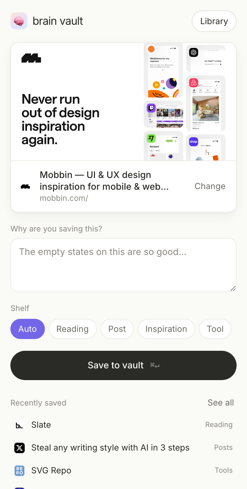
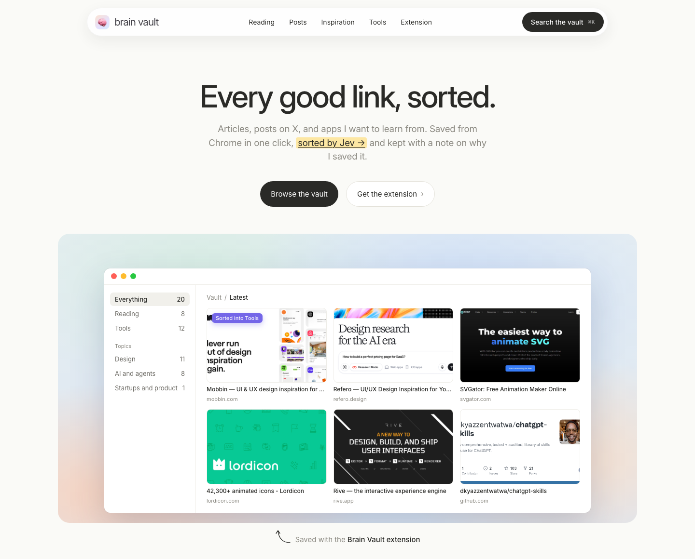

# Brain Vault

Every good link, sorted. A Chrome extension that saves articles, tweets, X articles, and app or website inspiration with a note on why you saved it. [Jev](https://docs.typesafe.ai) sorts each save by shelf, topic and tags, and your vault publishes to your own GitHub Pages site.

See it in action at [samyakjain0606.github.io/brain-vault](https://samyakjain0606.github.io/brain-vault/), and a real vault at [Samyak’s vault](https://samyakjain0606.github.io/brain-vault/vault.html).

<p>
  
  
</p>

## What it does

- **Save from any tab.** Click the icon, press `⌘⇧S`, or right-click a link. The panel shows the page and its preview image, and asks why you're saving it.
- **Screenshots for inspiration.** Pick the Inspiration shelf and it captures the tab. Use *Select area* to drag out just the part you care about.
- **Sorted for you.** Jev picks the shelf (Reading, Posts, Inspiration, Tools), one topic, and a few tags. Your own shelf choice always wins.
- **Your own site.** Everything lands in `vault.json` in a git repo. The included site reads it, and a Markdown mirror (`index.md`, `topics/*.md`) stays readable on GitHub.

## Set up your own

You need Chrome, Python 3.9 or newer (no packages to install), git, and a [TypeSafe API key](https://console.typesafe.ai) for Jev.

**1. Get the code**

```sh
git clone https://github.com/samyakjain0606/brain-vault-extension
cd brain-vault-extension
```

**2. Make a vault repo.** Create an empty GitHub repo (for example `brain-vault`), clone it, and copy the site in:

```sh
git clone https://github.com/<you>/brain-vault ~/brain-vault
cp site/index.html site/favicon.png ~/brain-vault/
```

Edit the `window.BRAIN_VAULT` block at the top of `~/brain-vault/index.html` with your name and GitHub handle. Then turn on GitHub Pages for the repo (Settings → Pages → deploy from `main`).

**3. Configure the helper**

```sh
cp bridge/.env.example bridge/.env
```

Set `TYPESAFE_API_KEY`, and `BRAIN_VAULT_DIR=~/brain-vault` if your vault isn't at `~/articles`.

**4. Start the helper**

```sh
python3 bridge/server.py
```

It listens on `localhost:5128`. Keep it running while you save. The footer of the extension shows whether it's reachable.

**5. Load the extension.** Open `chrome://extensions`, turn on Developer mode, click *Load unpacked*, and pick this folder.

Save something with *Publish to GitHub* switched on, and it appears on your site a minute later.

## How sorting works

Each save becomes one request to Jev, with every question answered in parallel over the same page summary:

| Question | Type | Answer |
| --- | --- | --- |
| Which shelf? | Choice | reading, post, inspiration, tool |
| Main topic? | Choice | one of the topics in `bridge/taxonomy.py`, or "other" |
| Does tag X apply? | Noul (yes/no), one per tag | tags above 0.6 are kept, at most four |

Code handles the facts: tweet and X article links are recognised from the URL, your explicit shelf always wins, and descriptions come from the page's own summary rather than generated text. Jev's raw probabilities are stored with each item, so thresholds can change later without asking again. If Jev's shelf confidence is low, the item is flagged `needsReview`.

Without a key the helper still works, using simple keyword rules.

**Change the categories** by editing `bridge/taxonomy.py`. The descriptions are what Jev reads, so keep them concrete and non-overlapping. Then re-sort everything:

```sh
python3 bridge/migrate.py --reclassify
```

## What leaves your machine

- The page's title, description, a short text excerpt, and your note go to TypeSafe for sorting.
- Your vault goes to your GitHub repo when *Publish to GitHub* is on.
- Screenshots are stored in your vault's `shots/` folder and are published with it.

Nothing else is sent anywhere.

## Files

```
manifest.json, background.js    Chrome extension (Manifest V3)
sidepanel.*                     the save panel and library
content/select-area.js          drag-to-select overlay for screenshots
bridge/server.py                local helper the extension talks to
bridge/pipeline.py              page reading, URL rules, Jev, final decision
bridge/jev.py                   the Jev questions and how answers are read
bridge/taxonomy.py              shelves, topics and tags
bridge/vault.py                 vault.json and the Markdown mirror
bridge/migrate.py               import older data, or re-sort everything
site/                           the website that reads vault.json
```

## License

MIT
